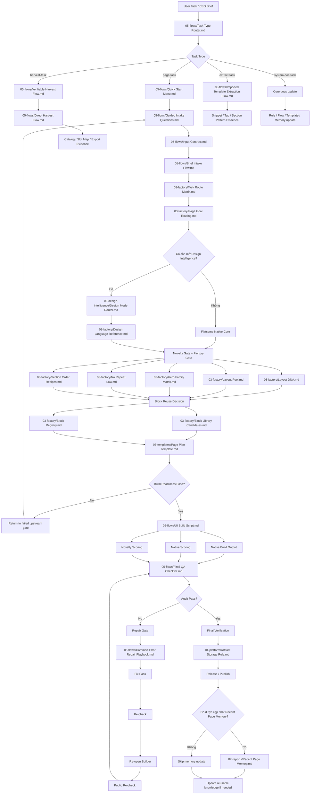

# Master System Flow Map

Date: 2026-04-25

## Mục Đích

Đây là lưu đồ tổng từ `A -> Z` cho toàn bộ hệ `flatsome-native`.

File này tồn tại để:

- nhìn toàn hệ trong `1` chỗ
- check flow có bị thiếu bước hay không
- check loop sửa lỗi có đủ chặt hay không
- route AI mới vào đúng lớp tài liệu nhanh hơn

## Flow Tổng Cấp Hệ

## Flow Tổng Dạng Tuyến Tính

`User Task -> Task Type Router -> (page-task | harvest-task | extract-task | system-doc-task)`

Với `page-task`:

`Quick Start -> Guided Intake -> Input Contract -> Brief Intake -> Task Route -> Page Goal Routing -> Design Mode / Native Core -> Novelty Gate -> Block Reuse Decision -> Page Plan -> Build Readiness -> Build -> Native Output + Scoring -> Audit -> Repair Gate -> Final Verification -> Artifact Storage -> Release -> Memory Update Decision -> Reusable Knowledge Update`

## Gate Bắt Buộc

### Gate 0: Task Type Gate

Chỉ pass khi đã chốt task thuộc loại nào:

- `page-task`
- `harvest-task`
- `extract-task`
- `system-doc-task`

File điều phối:

- `05-flows/Task Type Router.md`

Nếu chưa khóa task type:

- chưa được mở flow chi tiết
- chưa được nói đây là page delivery flow

### Gate 1: Intake Gate

Chỉ pass khi đã khóa:

- `loại input`
- `output expectation`
- `style source`
- `reference authority`
- `CTA chính`
- `thiết bị ưu tiên`

File điều phối:

- `05-flows/Quick Start Menu.md`
- `05-flows/Guided Intake Questions.md`
- `05-flows/Input Contract.md`
- `05-flows/Brief Intake Flow.md`

### Gate 2: Route Gate

Chỉ pass khi đã chốt:

- `clone / reinterpret / original`
- `Flatsome Native Core` hay `Design Intelligence`
- `Skeleton`
- `Archetype`
- `section starter direction`

File điều phối:

- `03-factory/Task Route Matrix.md`
- `03-factory/Page Goal Routing.md`
- `08-design-intelligence/Design Mode Router.md`
- `03-factory/Section Starter Snippets.md`

### Gate 3: Novelty Gate

Chỉ pass khi đã chốt:

- `Layout DNA`
- `Layout Pool`
- `Hero Family`
- `Section Order Recipe`
- `Macro Sequence Fingerprint`
- `Similarity Risk`
- `Novelty Score dự kiến`

Không được build nếu:

- `Similarity Risk = Blocked`
- `Novelty Score dự kiến < 10`

File điều phối:

- `03-factory/Layout DNA.md`
- `03-factory/Layout Pool.md`
- `03-factory/Hero Family Matrix.md`
- `03-factory/No Repeat Law.md`
- `03-factory/Section Order Recipes.md`
- `01-platform/Novelty Scoring Rule.md`
- `07-reports/Recent Page Memory.md`

### Gate 3B: Block Reuse Gate

Chỉ pass khi đã chốt:

- `section nào tái dùng block sẵn có`
- `section nào tạo mới`
- `block nào là page-only`
- `block nào có thể nâng lên thư viện công ty`

Nếu archetype đã có ứng viên `P1` mà vẫn dựng mới từ đầu:

- phải ghi rõ lý do trong `Page Plan`

File điều phối:

- `03-factory/Block Library Candidates.md`
- `03-factory/Block Registry.md`
- `03-factory/Section Archetypes.md`

### Gate 4: Build Readiness Gate

Chỉ pass khi:

- đã có `Page Plan`
- đã có `Section Map`
- đã ghi `Unknowns`
- đã ghi `default an toàn`
- đã chốt `Typography direction`
- đã chốt `Spacing profile`
- đã chốt `Hero title budget`
- đã chốt `Heading wrapper risk`
- đã ghi `Reuse từ block sẵn có`

File điều phối:

- `06-templates/Page Plan Template.md`

Nếu `Build Readiness` fail:

- không được nhảy thẳng sang build
- phải quay lại đúng gate bị fail:
  - `Intake`
  - `Route`
  - `Novelty`
  - hoặc `Page Plan`
- không mặc định coi đây chỉ là lỗi hỏi thiếu ở `Guided Intake`

### Gate 5: Audit Gate

Chỉ pass khi:

- `public` ổn
- `edit` ổn
- `builder` mở lại được
- `native >= 90%`
- `Novelty Score cuối >= 10`
- không còn lỗi `blocking`

File điều phối:

- `05-flows/Final QA Checklist.md`

### Gate 6: Repair Gate

Nếu audit fail, phải đi đúng loop:

`Classify lỗi -> Fix -> Re-check -> Re-open Builder -> Public Re-check -> Audit lại`

File điều phối:

- `05-flows/Common Error Repair Playbook.md`
- `05-flows/UI Build Script.md`
- `06-templates/Fix Pass Template.md`

### Gate 7: Release Gate

Chỉ release khi:

- `Final Verification` đã có
- artifact lưu đúng chỗ
- novelty memory được cập nhật nếu task là page mới

File điều phối:

- `06-templates/Final Verification Template.md`
- `01-platform/Artifact Storage Rule.md`
- `07-reports/Recent Page Memory.md`

### Gate 8: Memory Update Gate

Chỉ cập nhật `07-reports/Recent Page Memory.md` nếu đồng thời đúng:

- đây là `page-task`
- page thật sự là page mới hoặc page được rebuild đủ lớn
- page đã qua `Release Gate`
- page thuộc chuỗi cần so novelty về sau

`Rebuild đủ lớn` nghĩa là đúng ít nhất `1` trong các điều sau:

- đổi ít nhất `2/4` novelty axes trọng yếu:
  - `Hero Family`
  - `Layout Pool`
  - `Dominant Geometry`
  - `CTA Pattern`
- đổi `Section Order Recipe` và đổi hierarchy chính của page
- đổi hero structure + flow chuyển đổi đủ mạnh để cần ghi vào novelty memory

Không cập nhật nếu task là:

- `harvest-task`
- `extract-task`
- `system-doc-task`
- hoặc chỉ là sửa lỗi nhỏ / docs-only / syntax-only

## Route Nhánh Theo Kiểu Task

### Nhánh Build UI Chuẩn

`Quick Start -> Guided Intake -> Input Contract -> Brief Intake -> Task Route -> Page Goal Routing -> Design Mode / Native Core -> Novelty Gate -> Block Reuse Decision -> Page Plan -> Build Readiness -> Build -> Audit -> Repair -> Release`

### Nhánh Harvest / Hút

`Harvest Request -> Verifiable Harvest Flow -> Direct Harvest Flow -> Imported Template Extraction Flow -> Studio Library Update -> Native Map Update`

File điều phối:

- `05-flows/Verifiable Harvest Flow.md`
- `05-flows/Direct Harvest Flow.md`
- `05-flows/Imported Template Extraction Flow.md`

### Nhánh Creative-Modern

`Quick Start -> Guided Intake -> Input Contract -> Task Route -> Design Mode Router -> Design Language Reference -> Typography / Spacing / Motion -> Page Plan -> Build`

### Nhánh System Docs

`Task Type Router -> Core docs identify -> Update docs -> Verify links -> Save report`

## Anti-Loop Rules

### Rule 1

Nếu fail ở `Build Readiness`, phải quay về `đúng gate bị fail`, không được mặc định quay về hỏi lại từ đầu.

### Rule 2

Nếu fail ở `Audit`, không được quay về `Input Contract` hay `Page Plan` trừ khi lỗi thật sự nằm ở route hoặc plan.

### Rule 3

Nếu task là `harvest-task`, không được lạc sang `Page Plan -> Build -> Final QA` như page delivery flow.

### Rule 4

Nếu task là `system-doc-task`, không được cập nhật `Recent Page Memory`.

### Rule 5

Không được chạy vòng:

`Input Contract -> Guided Intake -> Input Contract -> Guided Intake`

nhiều hơn `1` vòng nếu unknowns không đổi.

Khi đó phải:

- ghi rõ unknown nào đang block
- chốt `không xác định`
- hoặc dừng route vì brief chưa đủ dữ liệu

### Rule 6

Không được chạy vòng:

`Audit -> Fix -> Publish -> Done`

nếu chưa có:

- `Re-check`
- `Re-open Builder`
- `Public Re-check`

## Nơi Dễ Rơi Lỗi Nhất

1. Nhảy từ brief sang build, bỏ qua `Input Contract`.
2. Chưa khóa `output expectation` nhưng đã chọn route.
3. Chưa qua novelty gate nhưng đã lập `Page Plan`.
4. Có `Page Plan` nhưng chưa đủ `Build Readiness`.
5. Audit xong sửa vội, không đi đủ `Repair Gate`.
6. Publish xong nhưng chưa ghi `Final Verification`.
7. Không cập nhật `Recent Page Memory`, làm novelty gate yếu đi ở task sau.
8. `Build Readiness` fail nhưng worker quay sai về đầu flow, gây hỏi lại lan man không cần thiết.
9. Dùng nhầm flow `page-task` cho `harvest-task`.
10. Cập nhật `Recent Page Memory` cho task không phải page delivery.
11. Bỏ qua `block reuse decision`, làm section lặp lại nhưng không được quản trị như tài sản.

## Câu Hỏi Check Flow

Khi review hệ, phải tự hỏi:

1. Worker có thể vào bằng brief ngắn mà vẫn bị ép đi qua intake gate không?
2. Worker có thể route đúng mà không cần đoán không?
3. Worker có bị chặn đủ mạnh trước khi build không?
4. Worker có bị ép quay lại audit sau mỗi vòng sửa không?
5. Worker có bị ép lưu artifact đúng chỗ không?
6. Worker có bị ép cập nhật novelty memory cho task sau không?

## Kết Luận

Nếu một worker đi đúng file này và mở tiếp các file được chỉ rõ ở từng gate, thì sẽ không bị rơi bước lớn trong hệ `flatsome-native`.
