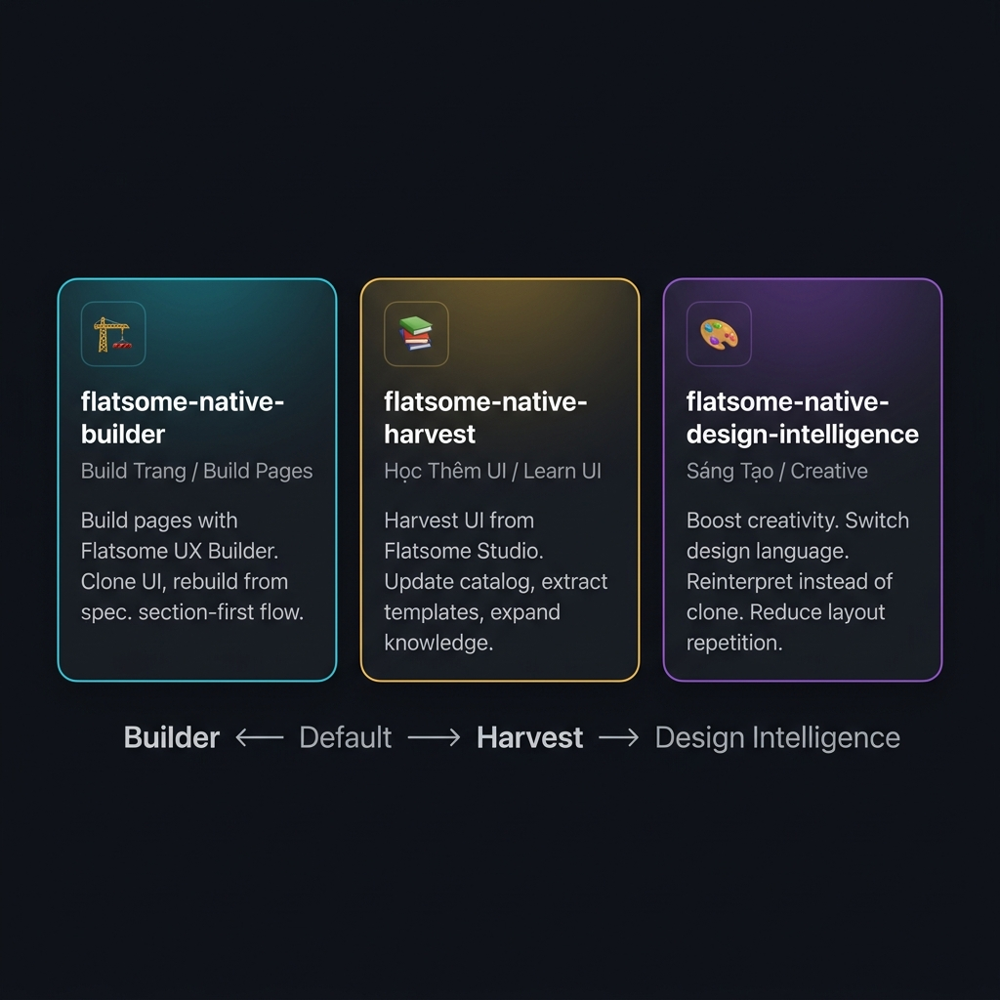
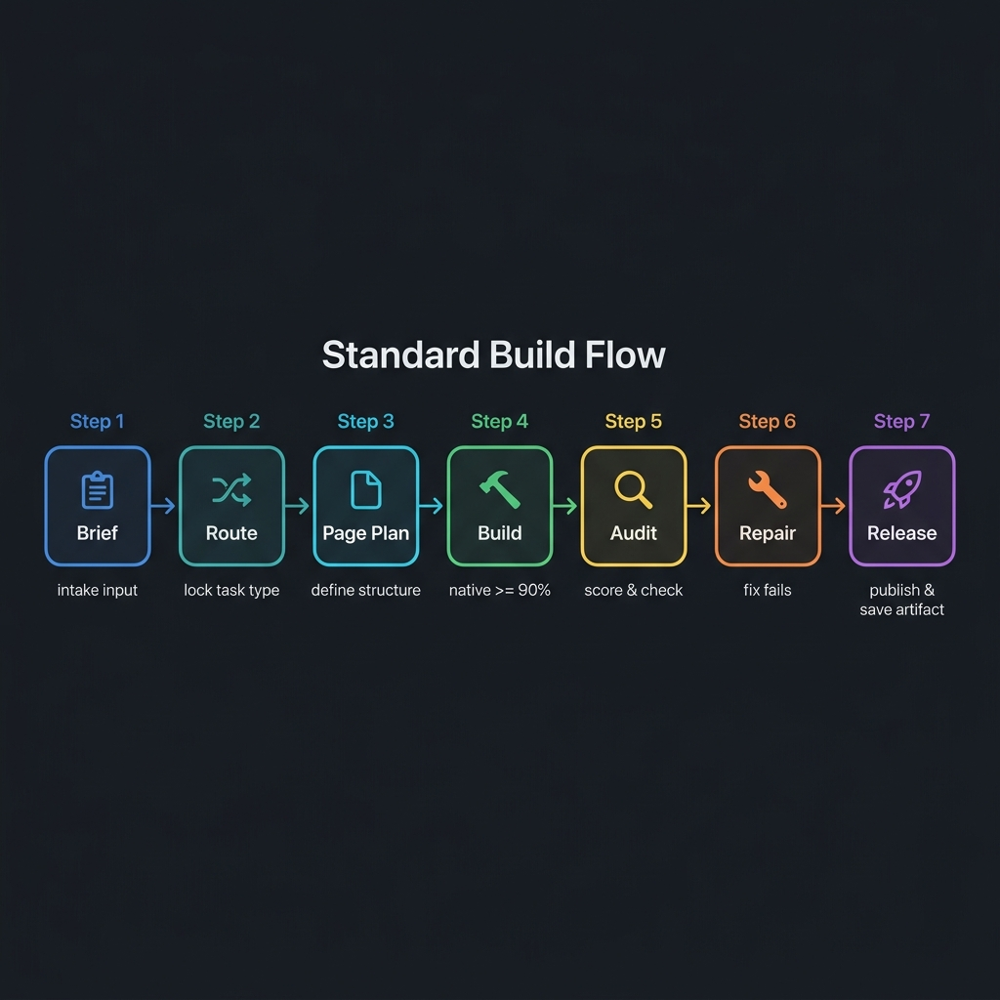

<div align="center">


<br/>

[](LICENSE)
[]()
[]()
[]()
[]()

<br/>

**[🇬🇧 English](#-english) · [🇻🇳 Tiếng Việt](#-tiếng-việt)**

</div>

---

## 🇬🇧 ENGLISH

### 📌 What Is This?

**Flatsome Native Knowledge Hub** is a structured operating system for building WordPress pages with **Flatsome UX Builder** — the right way.

It is not just a collection of shortcode references.  
It is a full knowledge system: rules, build flows, design intelligence, reusable templates, and AI-ready skill definitions — all in one repo.

> **Core principle:** Every UI must be `section-first`, built with native Flatsome elements, and remain editable in the drag-and-drop Builder.

---

### 🎯 Why Does It Exist?

| Problem | Solution |
|---|---|
| AI jumps straight from brief → shortcode, skipping planning | Enforced intake + routing gates before any build |
| Pages look the same every time | Novelty Gate blocks repeated layouts |
| Edits break the Builder | Native ≥ 90% rule, no `ux_html` for layout |
| Knowledge lost between AI sessions | Single-file Master Operating Memory for fast reload |
| No standard for where to save artifacts | Artifact Storage Rule with defined paths |

---

### ✨ Key Features

- 🏗️ **Section-first build system** — strict `section → row → col → element` hierarchy
- 🎯 **Native ≥ 90% rule** — minimize `ux_html`, maximize Flatsome Builder elements
- 🔀 **Task routing** — every task is classified before building begins
- 🔁 **Novelty Gate** — prevents repetitive layouts across pages
- 📋 **9 mandatory artifact types** per page task
- 🤖 **AI-ready** — structured for Codex, GPT, Claude, and any AI worker
- 📚 **492 Studio slots cataloged** — 337 unique template IDs
- 🎨 **Optional design intelligence layer** — for creative or non-default builds
- 🔧 **Repair Gate** — automated draft fallback when preflight fails

---

### 🧠 The 3 Skills



<br/>

#### 🏗️ Skill 1 — `flatsome-native-builder` (Build Pages)

The **default skill**. Use this for almost all tasks.

| | |
|---|---|
| **Call phrase** | `use flatsome-native-builder_(Build_Trang)` |
| **Use when** | Building a new page, cloning a UI, rebuilding from spec, brief, image, or link |
| **Do NOT use when** | Main goal is harvesting UI or researching creative directions |
| **Output** | Page Plan → Native Build → Audit → Repair → Release |

**Internal flow:**
```
Brief Intake → Task Route → Input Contract → Page Plan → Build → Audit → Repair → Release
```

---

#### 📚 Skill 2 — `flatsome-native-harvest` (Learn UI)

The **knowledge expansion skill**. Use when you want to learn more from Flatsome Studio.

| | |
|---|---|
| **Call phrase** | `use flatsome-native-harvest_(Hoc_Them_UI)` |
| **Use when** | Harvesting templates from Flatsome Studio, updating catalog, extracting evidence |
| **Do NOT use when** | Main goal is delivering a complete page |
| **Output** | Updated slot catalog, template evidence, native map expansion |

**Current catalog stats:**
- Visible Studio slots: **492**
- Unique template IDs: **337**
- Duplicate slots: **155**

---

#### 🎨 Skill 3 — `flatsome-native-design-intelligence` (Creative)

The **advanced creativity skill**. Only activate when default Flatsome aesthetics aren't enough.

| | |
|---|---|
| **Call phrase** | `use flatsome-native-design-intelligence_(Sang_Tao)` |
| **Use when** | Need stronger creativity, switching design language, reinterpreting instead of cloning |
| **Do NOT use when** | Standard page build with default Flatsome style is sufficient |
| **Output** | Design direction proposals, style taxonomy, typography + spacing decisions |

---

### 🔄 Standard Build Flow



<br/>

Every page task goes through:

```
📋 Brief → 🔀 Route → 📄 Page Plan → 🔨 Build → 🔍 Audit → 🔧 Repair → 🚀 Release
```

Before `Page Plan`, the AI **must lock**:
- Input type (text / image / link / markdown / mixed)
- Output expectation (new page / clone / rebuild)
- Style source (Flatsome Native Core / custom design language)
- Reference authority
- Primary CTA
- Priority device

---

### 📂 Repository Structure

```
flatsome-native/
├── 📄 MASTER OPERATING MEMORY.md   ← Single-file fast-load for AI
├── 📄 START HERE.md                ← Fastest entry for humans & AI
├── 📄 SKILL SURFACE MAP.md         ← 3 skills definition
├── 📄 AI HANDOFF GUIDE.md          ← AI worker onboarding guide
├── 📄 PUBLIC READER GUIDE.md       ← Guide for public readers
├── 📄 HOW THIS HUB WORKS.md        ← Full system explanation
│
├── 📁 01-platform/                 ← Hard rules, syntax, scoring, storage
├── 📁 02-platform-studio-library/  ← 492 Studio slot catalog
├── 📁 03-factory/                  ← Build logic, layout DNA, anti-repeat
├── 📁 04-plans/                    ← System upgrade plans
├── 📁 05-flows/                    ← End-to-end operating flows
├── 📁 06-templates/                ← 9 standard artifact templates
├── 📁 07-reports/                  ← Evidence, audits, history
├── 📁 08-design-intelligence/      ← Optional advanced creativity layer
├── 📁 09-archive/                  ← Historical evidence
└── 📁 skills/                      ← 3 SKILL.md files for AI systems
    ├── flatsome-native-builder/
    ├── flatsome-native-harvest/
    └── flatsome-native-design-intelligence/
```

---

### 🚀 Quick Start for AI Workers

If you are an AI agent (Codex, GPT, Claude, etc.) starting a task:

```
1. Read: MASTER OPERATING MEMORY.md
2. Read: AI HANDOFF GUIDE.md
3. Read: 05-flows/Task Type Router.md
4. Read: 05-flows/Input Contract.md
5. Lock: input type + output expectation + style source
6. Route to correct skill
7. Follow the build flow
```

> ⚠️ **Never jump directly from brief to shortcode.** Always route first.

---

### 📖 Reading Path by Role

| Role | Start Here |
|---|---|
| 🤖 AI Worker (first time) | `AI HANDOFF GUIDE.md` → `MASTER OPERATING MEMORY.md` |
| 👤 Human Operator | `PUBLIC READER GUIDE.md` → `README.md` → `HOW THIS HUB WORKS.md` |
| ⚡ Need to build a page NOW | `05-flows/Quick Start Menu.md` → `05-flows/Input Contract.md` |
| 📚 Want to understand the system | `HOW THIS HUB WORKS.md` → `MASTER OPERATING MEMORY.md` |
| 🎨 Need creative direction | `08-design-intelligence/README.md` → `Design Mode Router.md` |

---

### 📋 Mandatory Artifacts Per Page Task

Every page task must produce:

| # | Artifact | Purpose |
|---|---|---|
| 1 | `Spec` | Task definition |
| 2 | `Input Contract` | Locked inputs & expectations |
| 3 | `Page Plan` | Section blueprint |
| 4 | `Native Build Output` | Shortcode output |
| 5 | `Native Scoring` | Native % measurement |
| 6 | `Novelty Scoring` | Layout uniqueness score |
| 7 | `Audit Checklist` | QA pass/fail |
| 8 | `Fix Pass` | Repair record |
| 9 | `Final Verification` | Release confirmation |

---

### ⚙️ Core Laws (Non-Negotiable)

```
✅ section-first always
✅ section → row → col → element hierarchy
✅ native >= 90% every page
✅ output must be re-openable in Flatsome UX Builder
✅ ux_html only for iframe / embed / link / map (rare exceptions)
✅ CSS lives in Theme Options, not inline
✅ reports do NOT override laws
✅ page-specific plans do NOT go into 04-plans/
```

---

### 📄 License

MIT License — see [LICENSE](LICENSE)

---

<br/>
<br/>

---

## 🇻🇳 TIẾNG VIỆT

### 📌 Đây Là Gì?

**Flatsome Native Knowledge Hub** là một hệ điều phối tri thức để build trang WordPress bằng **Flatsome UX Builder** — theo đúng quy trình.

Đây không chỉ là tập hợp shortcode.  
Đây là một **hệ thống tri thức đầy đủ**: luật vận hành, flow build, lớp sáng tạo, biểu mẫu artifact chuẩn, và định nghĩa 3 skill cho AI — tất cả trong một repo.

> **Nguyên tắc lõi:** Mọi UI phải theo `section-first`, dùng element native của Flatsome Builder, và phải mở lại được bằng kéo thả.

---

### 🎯 Tại Sao Repo Này Tồn Tại?

| Vấn Đề | Giải Pháp |
|---|---|
| AI nhảy thẳng từ brief → shortcode, bỏ qua bước lên kế hoạch | Buộc phải qua intake + routing gate trước khi build |
| Các trang trông giống nhau | Novelty Gate chặn layout lặp lại |
| Sửa trang làm hỏng Builder | Luật native ≥ 90%, không dùng `ux_html` cho layout |
| Tri thức mất giữa các phiên AI | File MASTER OPERATING MEMORY nạp nhanh toàn hệ |
| Không có chuẩn lưu artifact | Artifact Storage Rule với đường dẫn định nghĩa rõ |

---

### ✨ Tính Năng Chính

- 🏗️ **Hệ build section-first** — cấu trúc `section → row → col → element` nghiêm ngặt
- 🎯 **Luật native ≥ 90%** — tối thiểu hóa `ux_html`, tối đa hóa element native của Builder
- 🔀 **Route task** — mọi task phải được phân loại trước khi build
- 🔁 **Novelty Gate** — ngăn layout lặp lại giữa các trang
- 📋 **9 loại artifact bắt buộc** cho mỗi task trang
- 🤖 **AI-ready** — thiết kế cho Codex, GPT, Claude và mọi AI worker
- 📚 **492 Studio slots đã catalog** — 337 template ID duy nhất
- 🎨 **Lớp design intelligence tùy chọn** — cho build sáng tạo hoặc ngoài mặc định
- 🔧 **Repair Gate** — tự động kéo trang về draft nếu preflight thất bại

---

### 🧠 3 Skill Của Hệ


<br/>

#### 🏗️ Skill 1 — `flatsome-native-builder` (Build Trang)

Skill **mặc định**. Dùng cho hầu hết các task.

| | |
|---|---|
| **Câu gọi** | `use flatsome-native-builder_(Build_Trang)` |
| **Dùng khi** | Build trang mới, clone UI, rebuild từ spec, brief, ảnh hoặc link |
| **Không dùng khi** | Mục tiêu là harvest UI hoặc nghiên cứu sáng tạo |
| **Output** | Page Plan → Native Build → Audit → Repair → Release |

**Flow nội bộ:**
```
Brief Intake → Task Route → Input Contract → Page Plan → Build → Audit → Repair → Release
```

---

#### 📚 Skill 2 — `flatsome-native-harvest` (Học Thêm UI)

Skill **mở rộng tri thức**. Dùng khi muốn học thêm từ Flatsome Studio.

| | |
|---|---|
| **Câu gọi** | `use flatsome-native-harvest_(Hoc_Them_UI)` |
| **Dùng khi** | Harvest template từ Studio, cập nhật catalog, extract evidence |
| **Không dùng khi** | Mục tiêu là giao một trang hoàn chỉnh |
| **Output** | Slot catalog cập nhật, template evidence, native map mở rộng |

**Số liệu catalog hiện tại:**
- Studio slots: **492**
- Template ID duy nhất: **337**
- Slot trùng: **155**

---

#### 🎨 Skill 3 — `flatsome-native-design-intelligence` (Sáng Tạo)

Skill **sáng tạo nâng cao**. Chỉ mở khi mặc định Flatsome chưa đủ.

| | |
|---|---|
| **Câu gọi** | `use flatsome-native-design-intelligence_(Sang_Tao)` |
| **Dùng khi** | Cần sáng tạo mạnh hơn, đổi design language, reinterpret thay vì clone |
| **Không dùng khi** | Build trang chuẩn theo style Flatsome mặc định là đủ |
| **Output** | Đề xuất design direction, style taxonomy, quyết định typography + spacing |

---

### 🔄 Flow Build Chuẩn


<br/>

Mọi task trang đều đi qua:

```
📋 Brief → 🔀 Route → 📄 Page Plan → 🔨 Build → 🔍 Audit → 🔧 Repair → 🚀 Release
```

Trước `Page Plan`, AI **phải khóa**:
- Loại input (text / ảnh / link / markdown / mixed)
- Output expectation (trang mới / clone / rebuild)
- Style source (Flatsome Native Core / design language cụ thể)
- Reference authority
- CTA chính
- Thiết bị ưu tiên

---

### 📂 Cấu Trúc Thư Mục

```
flatsome-native/
├── 📄 MASTER OPERATING MEMORY.md   ← File nạp nhanh toàn hệ cho AI
├── 📄 START HERE.md                ← Entry point nhanh nhất
├── 📄 SKILL SURFACE MAP.md         ← Định nghĩa 3 skill
├── 📄 AI HANDOFF GUIDE.md          ← Hướng dẫn onboard AI worker
├── 📄 PUBLIC READER GUIDE.md       ← Hướng dẫn cho người đọc công khai
├── 📄 HOW THIS HUB WORKS.md        ← Giải thích hub từ đầu đến cuối
│
├── 📁 01-platform/                 ← Luật cứng, syntax, scoring, storage
├── 📁 02-platform-studio-library/  ← Catalog 492 Studio slots
├── 📁 03-factory/                  ← Logic build, layout DNA, anti-repeat
├── 📁 04-plans/                    ← Kế hoạch nâng cấp hệ
├── 📁 05-flows/                    ← Flow vận hành end-to-end
├── 📁 06-templates/                ← 9 biểu mẫu artifact chuẩn
├── 📁 07-reports/                  ← Bằng chứng, audit, lịch sử
├── 📁 08-design-intelligence/      ← Lớp sáng tạo nâng cao tùy chọn
├── 📁 09-archive/                  ← Bằng chứng lịch sử
└── 📁 skills/                      ← 3 file SKILL.md cho hệ thống AI
    ├── flatsome-native-builder/
    ├── flatsome-native-harvest/
    └── flatsome-native-design-intelligence/
```

---

### 🚀 Bắt Đầu Nhanh Cho AI Worker

Nếu bạn là AI (Codex, GPT, Claude, v.v.) bắt đầu một task:

```
1. Đọc: MASTER OPERATING MEMORY.md
2. Đọc: AI HANDOFF GUIDE.md
3. Đọc: 05-flows/Task Type Router.md
4. Đọc: 05-flows/Input Contract.md
5. Khóa: loại input + output expectation + style source
6. Route đến skill đúng
7. Làm theo flow build
```

> ⚠️ **Không bao giờ nhảy thẳng từ brief sang shortcode.** Phải route trước.

---

### 📖 Đường Đọc Theo Vai Trò

| Vai trò | Bắt đầu từ |
|---|---|
| 🤖 AI Worker (lần đầu) | `AI HANDOFF GUIDE.md` → `MASTER OPERATING MEMORY.md` |
| 👤 Người vận hành | `PUBLIC READER GUIDE.md` → `README.md` → `HOW THIS HUB WORKS.md` |
| ⚡ Cần build trang ngay | `05-flows/Quick Start Menu.md` → `05-flows/Input Contract.md` |
| 📚 Muốn hiểu cả hệ thống | `HOW THIS HUB WORKS.md` → `MASTER OPERATING MEMORY.md` |
| 🎨 Cần hướng sáng tạo | `08-design-intelligence/README.md` → `Design Mode Router.md` |

---

### 📋 Artifact Bắt Buộc Cho Mỗi Task Trang

| # | Artifact | Mục đích |
|---|---|---|
| 1 | `Spec` | Định nghĩa task |
| 2 | `Input Contract` | Khóa input & kỳ vọng output |
| 3 | `Page Plan` | Bản thiết kế section |
| 4 | `Native Build Output` | Shortcode output |
| 5 | `Native Scoring` | Đo % native |
| 6 | `Novelty Scoring` | Điểm độ mới của layout |
| 7 | `Audit Checklist` | Kiểm tra pass/fail |
| 8 | `Fix Pass` | Ghi lại sửa chữa |
| 9 | `Final Verification` | Xác nhận release |

---

### ⚙️ Luật Cứng (Không Được Tranh Luận)

```
✅ section-first luôn luôn
✅ cấu trúc section → row → col → element
✅ native >= 90% mỗi trang
✅ output phải mở lại được bằng Flatsome UX Builder
✅ ux_html chỉ cho iframe / embed / link / map (ngoại lệ hiếm)
✅ CSS ưu tiên ở Theme Options, không inline
✅ report không được thay thế luật
✅ page-specific plan không được nằm trong 04-plans/
```

---

### 📄 License

MIT License — xem [LICENSE](LICENSE)

---

<div align="center">

Made with ❤️ for Flatsome UX Builder operators and AI workers

**[⬆ Back to top](#-english)**

</div>
